# Real-Estate-Analysis-Project

## Overview
The overarching goal of this project is to use post-pandemic MLS real estate sales data to illustrate market trends. We will be foucsing on both the Traingle real estate market at large, as well as a couple individual cities such as Raleigh and Fayetteville. Specifically, we will be examining how variables such as seasonality and mortgage rates affect the difference between list and sale prices, days on market, and volume of homes listed.

## Installation
Begin by cloning the repo "Real-Estate-Analysis-Project" from github. This contains all the files required to run the analysis. Once cloned, the analysis code is entirely contained in the jupyter notebook "real-estate-analysis_updated.ipynb". All real estate data .csv files, as well as the data on mortgage rates, are found within the "Data" folder. 

## Data
Data on over 150,000 residential home sales were exported from the Triangle MLS to be used for this analysis. Data fields included the following: MLS#, Class, Property Type, Address, City, Zip Code, Neighborhood, Subdivision, Bedrooms, Baths, Square Footage, Acreage, Year Built, List Date, Closing Date, Days on Market, List Price, and Sold Price. Data was engineered as needed, such as ensuring that we only examine trends for comparable properties. Example data is shown below:

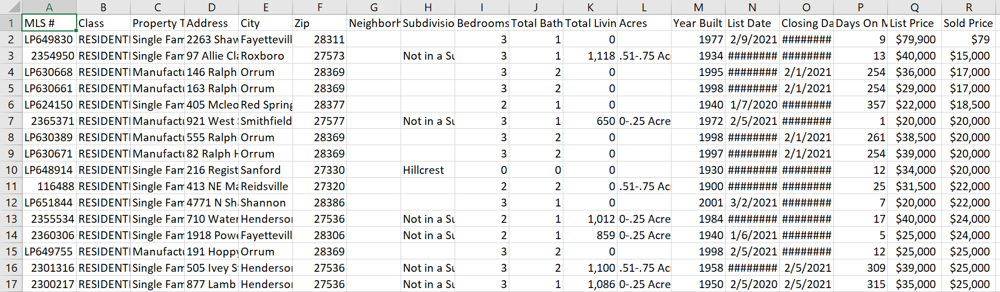

Columns with majority NaN or null occurrences were dropped, such as "Neighborhood" and "Subdivision". Acreage was listed as a given range if the property's actual acreage fell within that range, and this was split into two separate columns "Acres min" and "Acres max" which utilize the min and max values of the given range. Aggregate market data was examined alongside the individual cities of Raleigh and Fayetteville in order to compare trends. Raleigh and Fayettville were chosen to illustrate the difference in trends between the high and low price points in NC.

## Scope
The scope of this project is to use python visualizations, and rudimentary machine learning through the time-series model "Prophet", to answer questions about Triangle NC real estate market trends in general, and to make predictions for a specificallly-defined subset of homes. The general market questions are as follows:
1. How does seasonality affect the volume of homes listed?
1. How does seasonality affect the amount that individuals are paying over asking price (both as an absolute value and as a percentage of list price)?

Specific questions were answered which focused on comparable homes in the Raleigh and Fayetteville areas, with their criteria being, single-family detached homes, 3 beds, 2 baths:
1. How does seasonality affect the difference between list price and sold price?
1. How does seasonality affect days on market?
1. How do mortgage rates affect days on market?
1. How do mortgage rates affect the difference between list price and sold price?

    
## Results & Conclusions
When first looking at the results of the aggregate real estate market in the Triangle between 2021 and now, we see that, largely, the sum of all sales prices matches closely with that of the list price. This is to be expected, but one can see notable separation between the two during the spring months of 2021 and 2022, when the market was the hottest, and before interest rates rose significantly.

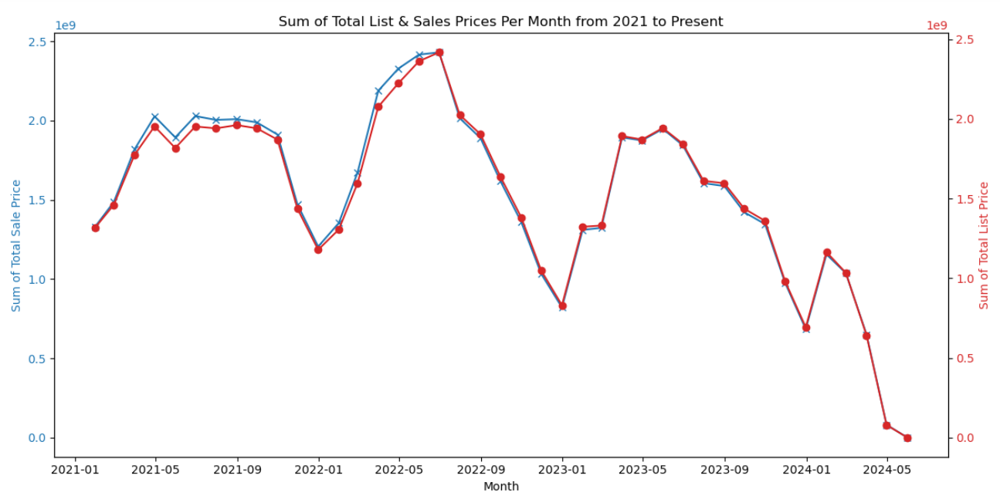

You also see obvious evidence of seasonality as both sets of values drop in the fall and winter. There is an obvious downtrend in late 2022 as well, which likely corresponds to a significant increase in mortgage rates.

Further, when looking at the total number of properties listed, you see a similar trend that reflects seasonality and mortgage rates. Volume dips in the winter and peaks in the spring, as well as gradually decreases since 2022.

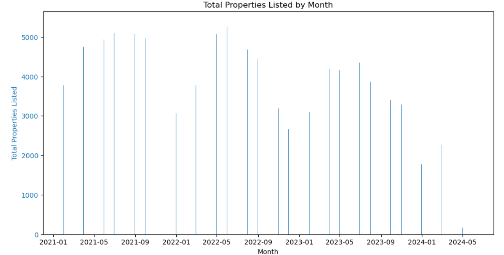

Now we focus on two specific NC cities: Raleigh and Fayetteville. These were chosen for the differences in their desirability, home values, area median income, etc., with Raleigh being a higher-earning and more desireable area, and Fayettevile being lower income but more affordable. 

When examining days on market, we see that the days on market in general is pretty comparable between Raleigh and Fayetteville for all seasons except the Spring. Raleigh on average does have slightly lower days on market than Fayettevile, but in the spring market shows a pretty significant difference of roughly five days less.

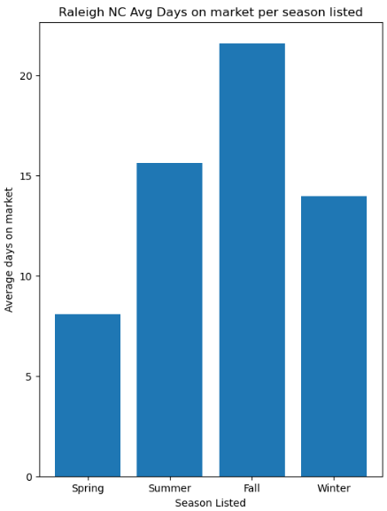

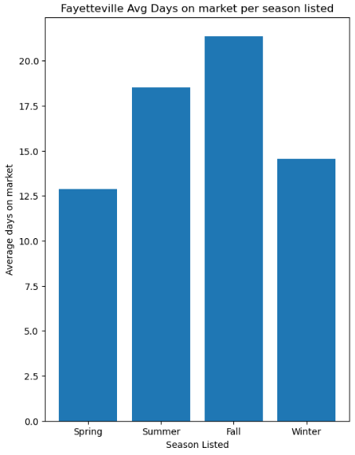

The delta between list and sale price of properties is a bit more telling when comparing between the two, as Fayetteville shows a relatively moderate delta, with a max of 3k over asking during the spring and a slight negative delta in the fall. Raleigh, on the other hand, shows people consistantly paying over asking, with an average delta of roughly 18k during the spring and a minimum of about 2k in the fall. This makes sense as Raleigh is a much hotter market, and bidding wars consistently push up prices, compelling individuals to offer significantly more than asking price. The price point is also higher in general and the buyers in this area tend to have more purchasing power, so naturally as a percentage of sales price, this leads to a larger delta.

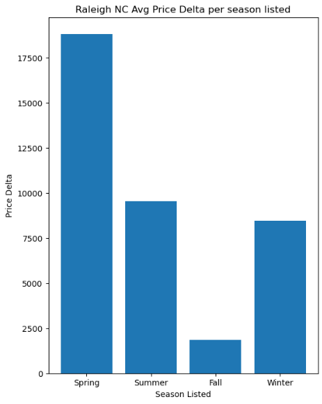

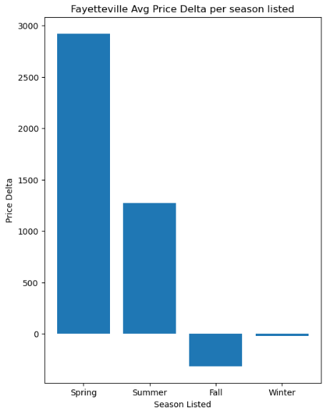

Next, we examine how mortgage rates have affected the real estate market in Raleigh and Fayetteville. We see that, for Raleigh, after accounting for seasonality, there is an obvious correlation between days on market and mortgage rates, with DOM spiking from roughly 10 days to 30 after the mortgage rate spike in 2022. Fayetteville, however, does not show a significant difference here, which may be due to the lower average price point, since even with the higher rates the monthly payment may still be affordable for individuals. In addition to this, there is a considerable amount of section 8 housing in Fayetteville compared to Raleigh, which makes the living more affordable, and so people are less likely to be deterred from purchasing.

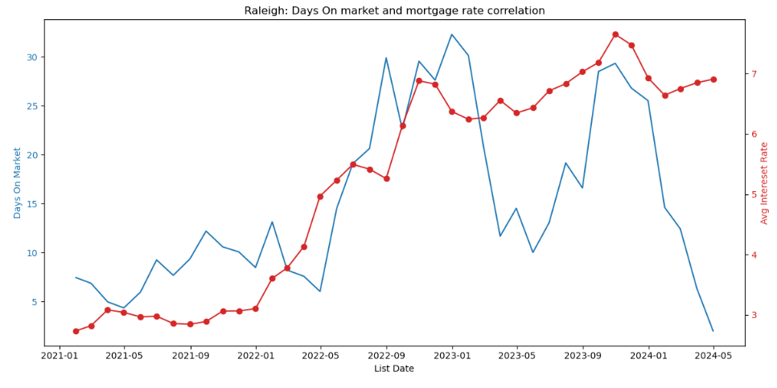

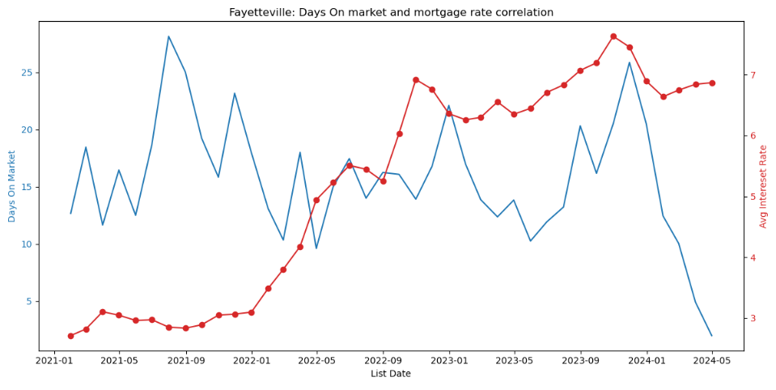

Lastly, when observing the trend in the list-sale price delta relative to mortgage rates, we do indeed see an inverse correlation. As expected, as rates increased, people in general became less willing to offer a significant amount over asking price. While you see the same trend in both cases, one notes that this is still significantly affected by seasonality, with the average spring/summer price delta for Raleigh still reaching over 20k. The delta for Fayetteville again is more moderate, with sale price hovering right around list, and even slightly below after the mortgage rate increase in 2022.

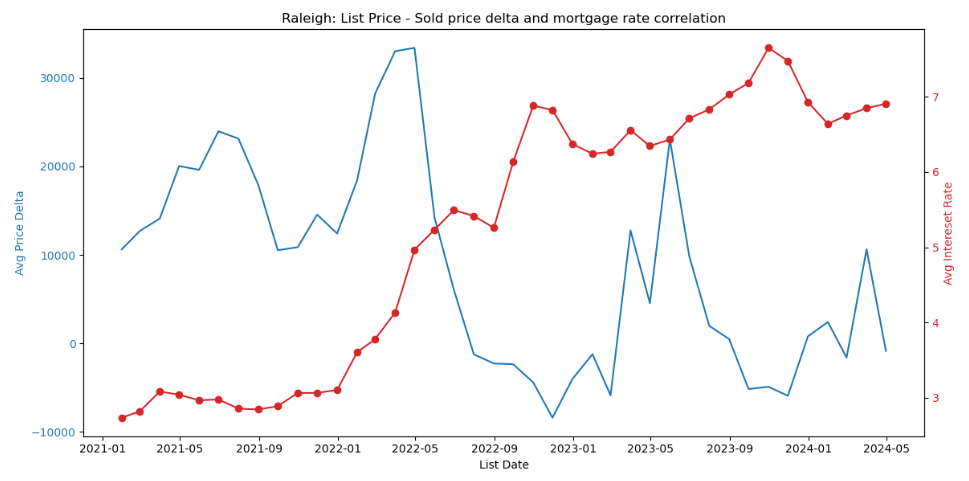

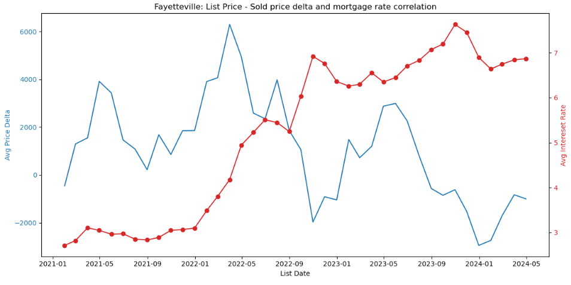

